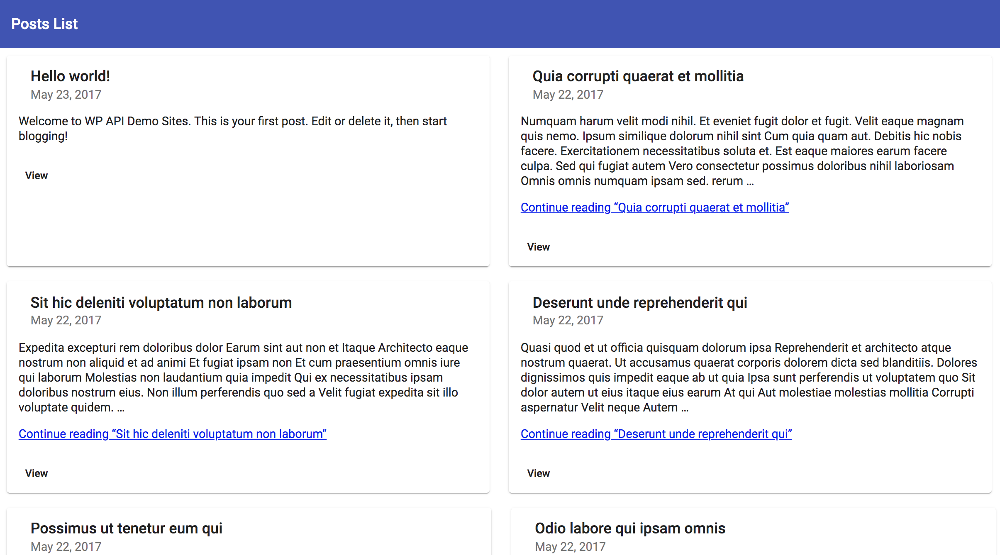
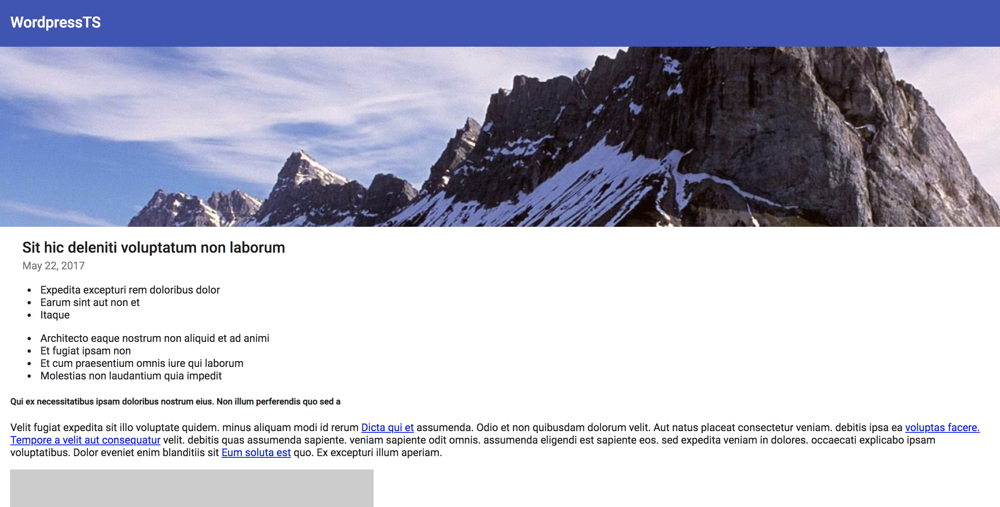

# WordpressTS
Angular Front-End App for Headless CMS (Wordpress modified). Fetches posts as JSON via API, and renders Material theme.

## /posts
  

## /post/[slug]

The goal behind this project is to remove the front-end from the back-end WordPress installation. As of WordPress 4.7, the WP-API is integrated into WordPress core. By utilizing WP-API and other plugins you can turn your WordPress installation into a back-end API endpoint.

Back-end: <a href="https://github.com/k1n4kut4/Wordpress-Decapitated">https://github.com/k1n4kut4/Wordpress-Decapitated</a>
  
By decoupling front-and back-ends this project aims to:  
- Make theme development easier--no PHP!  
- Enable back-end-as-a-service for WordPress (i.e. WordPress is installed on a different server than your front-end files)  
- Speedier blogs and websites (e.g. CDN for your front-end and caching of API requests)  
- Render a Material theme - typical WP themes feature PHP code, and they are not suitable for Angular, unless severely refactored, with considerable cost in development time - makes more sense to just build an Angular Material theme.

This project was generated with [Angular CLI](https://github.com/angular/angular-cli) version 8.1.1.

## Development server

Run `ng serve` for a dev server. Navigate to `http://localhost:4200/`. The app will automatically reload if you change any of the source files.

## Code scaffolding

Run `ng generate component component-name` to generate a new component. You can also use `ng generate directive|pipe|service|class|guard|interface|enum|module`.

## Build

Run `ng build` to build the project. The build artifacts will be stored in the `dist/` directory. Use the `--prod` flag for a production build.

## Running unit tests

Run `ng test` to execute the unit tests via [Karma](https://karma-runner.github.io).

## Running end-to-end tests

Run `ng e2e` to execute the end-to-end tests via [Protractor](http://www.protractortest.org/).

## Further help

To get more help on the Angular CLI use `ng help` or go check out the [Angular CLI README](https://github.com/angular/angular-cli/blob/master/README.md).
